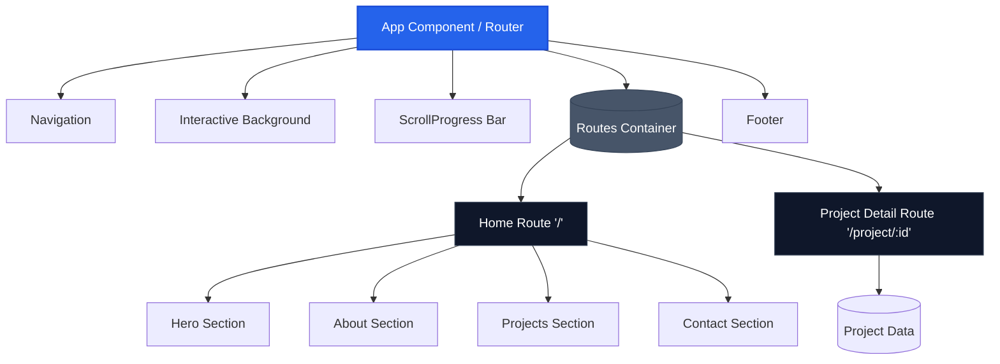
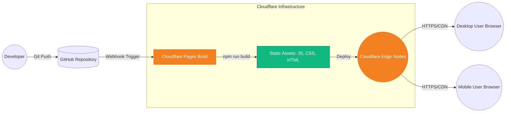

# Colton Hatfield - Personal Portfolio V2.0

A personal portfolio website showcasing my projects, skills, and experience in Cybersecurity and Computing Infrastructure & Network Engineering Technology at Purdue University.

Designed with a sleek, editorial-meets-terminal aesthetic, highlighting an active homelab, enterprise network engineering skills, system administration, and security best practices.

## 🚀 Live Site
[coltonhatfield.com](https://coltonhatfield.com)

## 🛠️ Built With
* **React 19**
* **TypeScript**
* **Vite** (Build Tool)
* **Tailwind CSS v4** (Styling)
* **Framer Motion** (Animations)
* **Lucide React** (Icons)

## 💻 Running Locally

To run this project on your local machine:

1. **Clone the repository:**
   ```bash
   git clone https://github.com/coltonhatfield/Colton-Hatfield-Personal-Website.git
   cd Colton-Hatfield-Personal-Website
   ```

2. **Install dependencies:**
   ```bash
   npm install
   ```

3. **Start the development server:**
   ```bash
   npm run dev
   ```
   *The site will be available at `http://localhost:3000` (or the port specified in your terminal).*

## ☁️ Deployment (Cloudflare Pages)

This project is configured to be deployed as a static site using **Cloudflare Pages**, not Cloudflare Workers. 

If you are connecting your GitHub repository directly to Cloudflare Pages via the Cloudflare Dashboard, use these exact settings:

* **Production branch:** `main` (or `master`)
* **Framework preset:** `Vite` (or `React`)
* **Build command:** `npm run build`
* **Build output directory:** `dist`

*(Note: If you previously saw a default "Hello World" page, it means Cloudflare deployed a generic Worker script instead of building this React project. Deleting that Worker and creating a new "Pages" project from your GitHub repo using the `dist` folder will fix it!)*

## 🏛️ Architecture

### Logical Architecture
The application follows a component-based React architecture, centrally managed by the main `App` layout. It uses Framer Motion for interactive transitions within individual UI components.



### Physical Architecture
The site is built as a static Single Page Application (SPA) using Vite and is globally distributed via Cloudflare's Edge Network (Cloudflare Pages).



## 📂 Project Structure

* `/src/components/` - React components (Hero, About, Projects, Contact, Navigation)
* `/src/index.css` - Global Tailwind CSS and custom theme configurations
* `/src/App.tsx` - Main layout and page assembly
* `/public/` - Static assets (like `resume.pdf`)

## 📫 Contact
* **LinkedIn:** [Colton Hatfield](https://www.linkedin.com/in/colton-hatfield-299072332/)
* **Email:** [coltonrhatfield@gmail.com](mailto:coltonrhatfield@gmail.com)
